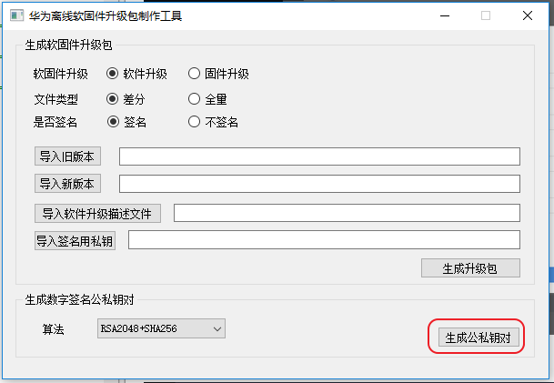
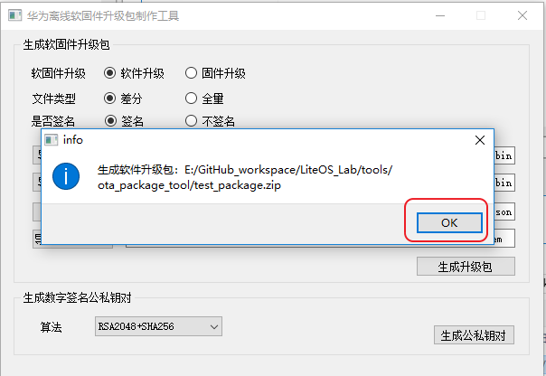
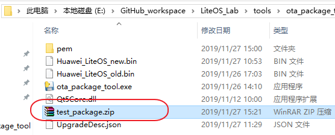
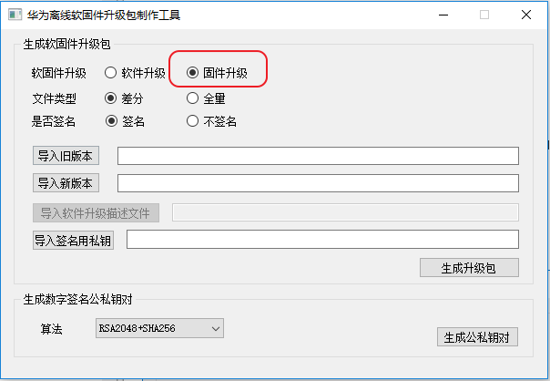
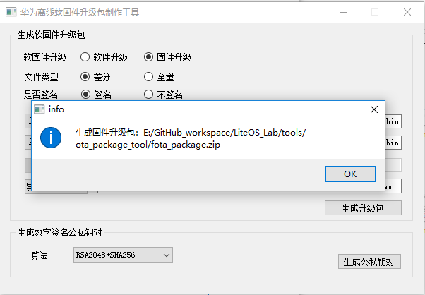

# ota_package_tool使用说明

<h1 id="1">1.前言</h1>

  本文档主要介绍如何通过ota_package_tool制作软固件升级包。

  github下载ota_package_tool.
 
https://github.com/LiteOS/LiteOS_Lab/tree/iot_link/tool/ota_package_tool/ota_package_tool.zip

<h1 id="2">2.制作软件升级包</h1>
<h2 id="2.1">2.1 制作软件升级描述文件</h2>
 软件升级描述文件内容摘自[https://support.huaweicloud.com/devg-IoT/iot_02_9983.html#toTop](https://support.huaweicloud.com/devg-IoT/iot_02_9983.html#toTop)。

软件升级描述文件包括软件版本、厂商名称、设备类型、产品模型等信息。

使用Notepad++文本工具新建一个文本文件，拷贝如下内容到文本中，在Notepad++工具的“编码”菜单中选择“以UTF-8无BOM格式编码”，文件名称命名为“UpgradeDesc”，保存类型选择“.json”。
	
	{
    	"specVersion": "",
    	"fileName": "",
    	"packageType": "",
    	"version": "",
    	"deviceType": "",
    	"manufacturerName": "",
    	"model": "",
    	"protocolType":"",
    	"description":"",
    	"versionCheckCode":"",
    	"deviceShard":"",
    	"platform":"",
    	"supportSourceVersionList":[],
    	"date":""
	}

打开创建的“UpgradeDesc.json”文件，修改软件升级描述文件，相关字段如下表所示。
<table id="ZH-CN_TOPIC_0188257817__zh-cn_topic_0188257813_table23638311372" border="1" rules="all" frame="border" cellspacing="0" cellpadding="4" summary="">
      <thead align="left">
       <tr id="ZH-CN_TOPIC_0188257817__zh-cn_topic_0188257813_row1942013116712">
        <th width="25%" class="cellrowborder" id="mcps1.3.4.3.3.2.1.1.4.1.1" valign="top">
字段名
 </th> 
        <th width="60%" class="cellrowborder" id="mcps1.3.4.3.3.2.1.1.4.1.2" valign="top">
字段描述
 </th> 
        <th width="15%" class="cellrowborder" id="mcps1.3.4.3.3.2.1.1.4.1.3" valign="top">
是否必填
 </th> 
       </tr> 
      </thead> 
      <tbody>
       <tr id="ZH-CN_TOPIC_0188257817__zh-cn_topic_0188257813_row5420193118711">
        <td width="25%" class="cellrowborder" valign="top" headers="mcps1.3.4.3.3.2.1.1.4.1.1 ">
specVersion
 </td> 
        <td width="60%" class="cellrowborder" valign="top" headers="mcps1.3.4.3.3.2.1.1.4.1.2 ">
描述文件版本号，固定值：“1.0”。
 </td> 
        <td width="15%" class="cellrowborder" valign="top" headers="mcps1.3.4.3.3.2.1.1.4.1.3 ">
是
 </td> 
       </tr> 
       <tr id="ZH-CN_TOPIC_0188257817__zh-cn_topic_0188257813_row34206313712">
        <td width="25%" class="cellrowborder" valign="top" headers="mcps1.3.4.3.3.2.1.1.4.1.1 ">
fileName
 </td> 
        <td width="60%" class="cellrowborder" valign="top" headers="mcps1.3.4.3.3.2.1.1.4.1.2 ">
软件包文件名，例如：“ExamplePackage_V1.0.10.xx”。
 </td> 
        <td width="15%" class="cellrowborder" valign="top" headers="mcps1.3.4.3.3.2.1.1.4.1.3 ">
是
 </td> 
       </tr> 
       <tr id="ZH-CN_TOPIC_0188257817__zh-cn_topic_0188257813_row895813561688">
        <td width="25%" class="cellrowborder" valign="top" headers="mcps1.3.4.3.3.2.1.1.4.1.1 ">
packageType
 </td> 
        <td width="60%" class="cellrowborder" valign="top" headers="mcps1.3.4.3.3.2.1.1.4.1.2 ">
软件包类型，必须设置为：“softwarePackage”。
 </td> 
        <td width="15%" class="cellrowborder" valign="top" headers="mcps1.3.4.3.3.2.1.1.4.1.3 ">
是
 </td> 
       </tr> 
       <tr id="ZH-CN_TOPIC_0188257817__zh-cn_topic_0188257813_row542123116716">
        <td width="25%" class="cellrowborder" valign="top" headers="mcps1.3.4.3.3.2.1.1.4.1.1 ">
version
 </td> 
        <td width="60%" class="cellrowborder" valign="top" headers="mcps1.3.4.3.3.2.1.1.4.1.2 ">
软件包版本号长度不超过16个字节，例如：“V1.0.10”
 </td> 
        <td width="15%" class="cellrowborder" valign="top" headers="mcps1.3.4.3.3.2.1.1.4.1.3 ">
是
 </td> 
       </tr> 
       <tr id="ZH-CN_TOPIC_0188257817__zh-cn_topic_0188257813_row842203115712">
        <td width="25%" class="cellrowborder" valign="top" headers="mcps1.3.4.3.3.2.1.1.4.1.1 ">
deviceType
 </td> 
        <td width="60%" class="cellrowborder" valign="top" headers="mcps1.3.4.3.3.2.1.1.4.1.2 ">
设备类型，需要与产品模型保持一致。例如：“WaterMeter”。
 </td> 
        <td width="15%" class="cellrowborder" valign="top" headers="mcps1.3.4.3.3.2.1.1.4.1.3 ">
是
 </td> 
       </tr> 
       <tr id="ZH-CN_TOPIC_0188257817__zh-cn_topic_0188257813_row24221131470">
        <td width="25%" class="cellrowborder" valign="top" headers="mcps1.3.4.3.3.2.1.1.4.1.1 ">
manufacturerName
 </td> 
        <td width="60%" class="cellrowborder" valign="top" headers="mcps1.3.4.3.3.2.1.1.4.1.2 ">
制造商名称，需要与产品模型保持一致。例如：“TestUtf8ManuName”。
 </td> 
        <td width="15%" class="cellrowborder" valign="top" headers="mcps1.3.4.3.3.2.1.1.4.1.3 ">
是
 </td> 
       </tr> 
       <tr id="ZH-CN_TOPIC_0188257817__zh-cn_topic_0188257813_row54221231973">
        <td width="25%" class="cellrowborder" valign="top" headers="mcps1.3.4.3.3.2.1.1.4.1.1 ">
model
 </td> 
        <td width="60%" class="cellrowborder" valign="top" headers="mcps1.3.4.3.3.2.1.1.4.1.2 ">
产品型号，需要与产品模型保持一致。例如：“TestUtf8ModelM2M”。
 </td> 
        <td width="15%" class="cellrowborder" valign="top" headers="mcps1.3.4.3.3.2.1.1.4.1.3 ">
是
 </td> 
       </tr> 
       <tr id="ZH-CN_TOPIC_0188257817__zh-cn_topic_0188257813_row5422163110718">
        <td width="25%" class="cellrowborder" valign="top" headers="mcps1.3.4.3.3.2.1.1.4.1.1 ">
protocolType
 </td> 
        <td width="60%" class="cellrowborder" valign="top" headers="mcps1.3.4.3.3.2.1.1.4.1.2 ">
设备接入协议类型，需要与产品模型保持一致。例如：“CoAP”。
 
         

           说明： 
          

           
设备接入的协议类型有二种：“CoAP”、“LWM2M”。
 
          

         
 </td> 
        <td width="15%" class="cellrowborder" valign="top" headers="mcps1.3.4.3.3.2.1.1.4.1.3 ">
是
 </td> 
       </tr> 
       <tr id="ZH-CN_TOPIC_0188257817__zh-cn_topic_0188257813_row134221316720">
        <td width="25%" class="cellrowborder" valign="top" headers="mcps1.3.4.3.3.2.1.1.4.1.1 ">
description
 </td> 
        <td width="60%" class="cellrowborder" valign="top" headers="mcps1.3.4.3.3.2.1.1.4.1.2 ">
对软件包的自定义描述。
 </td> 
        <td width="15%" class="cellrowborder" valign="top" headers="mcps1.3.4.3.3.2.1.1.4.1.3 ">
否
 </td> 
       </tr> 
       <tr id="ZH-CN_TOPIC_0188257817__zh-cn_topic_0188257813_row1982644141418">
        <td width="25%" class="cellrowborder" valign="top" headers="mcps1.3.4.3.3.2.1.1.4.1.1 ">
versionCheckCode
 </td> 
        <td width="60%" class="cellrowborder" valign="top" headers="mcps1.3.4.3.3.2.1.1.4.1.2 ">
软件升级包校验码，长度为4个字符。软件包下载时支持断点续传，根据该字段标识前后两次下载的软件包分片是否为同一个软件包。
 </td> 
        <td width="15%" class="cellrowborder" valign="top" headers="mcps1.3.4.3.3.2.1.1.4.1.3 ">
否
 </td> 
       </tr> 
       <tr id="ZH-CN_TOPIC_0188257817__zh-cn_topic_0188257813_row442313319720">
        <td width="25%" class="cellrowborder" valign="top" headers="mcps1.3.4.3.3.2.1.1.4.1.1 ">
deviceShard
 </td> 
        <td width="60%" class="cellrowborder" valign="top" headers="mcps1.3.4.3.3.2.1.1.4.1.2 ">
终端下载软件包的每个分片的大小，单位为byte，如果不设置默认为500byte。大小为32~500之间。
 </td> 
        <td width="15%" class="cellrowborder" valign="top" headers="mcps1.3.4.3.3.2.1.1.4.1.3 ">
否
 </td> 
       </tr> 
       <tr id="ZH-CN_TOPIC_0188257817__zh-cn_topic_0188257813_row143568340255">
        <td width="25%" class="cellrowborder" valign="top" headers="mcps1.3.4.3.3.2.1.1.4.1.1 ">
platform
 </td> 
        <td width="60%" class="cellrowborder" valign="top" headers="mcps1.3.4.3.3.2.1.1.4.1.2 ">
标识设备的操作系统，如linux。
 </td> 
        <td width="15%" class="cellrowborder" valign="top" headers="mcps1.3.4.3.3.2.1.1.4.1.3 ">
否
 </td> 
       </tr> 
       <tr id="ZH-CN_TOPIC_0188257817__zh-cn_topic_0188257813_row1136915469179">
        <td width="25%" class="cellrowborder" valign="top" headers="mcps1.3.4.3.3.2.1.1.4.1.1 ">
supportSourceVersionList
 </td> 
        <td width="60%" class="cellrowborder" valign="top" headers="mcps1.3.4.3.3.2.1.1.4.1.2 ">
支持用于升级此版本包的设备源版本列表。
 
支持通配符配置，*代表匹配任意0~n个字符，?代表匹配单个任意字符，如果存在多个版本，请使用英文“;”隔开。
 </td> 
        <td width="15%" class="cellrowborder" valign="top" headers="mcps1.3.4.3.3.2.1.1.4.1.3 ">
否
 </td> 
       </tr> 
       <tr id="ZH-CN_TOPIC_0188257817__zh-cn_topic_0188257813_row1287615210910">
        <td width="25%" class="cellrowborder" valign="top" headers="mcps1.3.4.3.3.2.1.1.4.1.1 ">
date
 </td> 
        <td width="60%" class="cellrowborder" valign="top" headers="mcps1.3.4.3.3.2.1.1.4.1.2 ">
出包时间，格式为：“yyyy-MM-dd”。
 </td> 
        <td width="15%" class="cellrowborder" valign="top" headers="mcps1.3.4.3.3.2.1.1.4.1.3 ">
否
 </td> 
       </tr> 
      </tbody> 
     </table>

<h2 id="2.2">2.2 制作签名用公私钥对</h2>
解压缩ota_package_tool.zip，打开ota_package_tool.exe

单击[生成公私钥对]，在弹出对对话框中选择保存公私钥目录，然后单击[选择文件夹]
公私钥钥对生成需要花费一两秒钟，请耐心等待生成结果。

生成公私钥对成功

私钥用于签名，公钥用于验签。

<h2 id="2.3">2.3 制作软件升级包</h2>
打开ota_package_tool.exe

选择“软件升级”。

如果要制作差分升级包，文件类型选择 “差分”，必须提供软件的旧版本和新版本；

如果制作全量升级包，选择“全量”，只需要提供软件新版本。

如果需要在软件包中附上签名信息，选择“签名”，必须导入签名用私钥；

如果不需要在软件包中附上签名信息，选择“不签名”。

单击[导入旧版本]，在弹出的对话框中选择软件旧版本

单击[导入新版本]，在弹出的对话框中选择软件新版本

单击[导入软件升级描述文件]，在弹出的对话框中选择已经制作好的软件升级描述文件

单击[导入签名用私钥]，在弹出的对话框中签名用的私钥文件

单击[生成软件包]，在弹出的对话话框中输入要保存的软件包名称

单击[保存]，弹出消息框单击[OK]

软件升级包制作成功。

<h1 id="3">3.制作固升级包</h1>

打开ota_package_tool.exe

选择“固件升级”。

如果要制作差分升级包，文件类型选择 “差分”，必须提供软件的旧版本和新版本；

如果制作全量升级包，选择“全量”，只需要提供软件新版本。

如果需要在固件包中附上签名信息，选择“签名”，必须导入签名用私钥；

如果不需要在固件包中附上签名信息，选择“不签名”。

单击[导入旧版本]，在弹出的对话框中选择软件旧版本

单击[导入新版本]，在弹出的对话框中选择软件新版本

单击[导入签名用私钥]，在弹出的对话框中签名用的私钥文件

单击[生成软件包]，在弹出的对话话框中输入要保存的固件包名称

单击[保存]，弹出消息框单击[OK]

固件升级包制作成功。